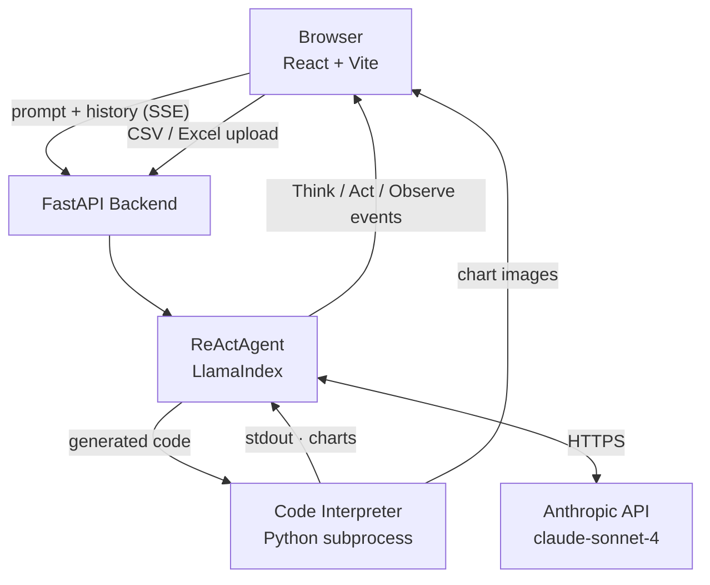

# AI Data Analyst — AI-Powered Data Analysis Web Application

> CISC 520 Final Project | Week 1 Prototype

An agentic AI system that lets users perform data analysis through natural language. Users describe what they want — *"Fetch Apple stock prices for the last 100 days and plot a chart"* — and the agent generates Python code, executes it, interprets the results, and presents findings in a clean chat interface.

---

## 🚀 Live Demo

**[https://ai-data-analyst-xi.vercel.app/](https://ai-data-analyst-xi.vercel.app/)**

---

## Architecture



### API Routes

| Route | Purpose |
|-------|---------|
| `POST /api/agent_analyse/stream` | ReAct loop over SSE — pushes each Think/Act/Observe step to the browser as it happens |
| `POST /api/upload` | Accepts a CSV/Excel file, saves it to `uploads/`, returns `file_path` and `file_name` |
| `GET /health` | Liveness check; returns active model name |
| `GET /charts/<filename>` | Serves chart PNGs saved by the agent |

### Data Models (`models.py`)

```
AnalyzeRequest          prompt + history[]
AnalyzeResponse         code, output, summary, plots[], thinking[]

AgentAnalyzeRequest     prompt + history[]
AgentAnalyzeResponse    summary, events[], charts[]

AgentEvent              current_label ("Think" | "Act")
                        content          ← reasoning text (Think)
                        tools[]          ← ToolInvocation list (Act)

ToolInvocation          toolname, queryparams, output
```

### ReAct Agent internals (`agent_service.py`)

The agent runs a LlamaIndex `ReActAgent` with `streaming=False` and captures each structured event via `stream_events()`:

- **AgentOutput** → extracts `Thought:` text → emitted as a `Think` event
- **ToolCall** → records tool name + kwargs → emitted as an `Act` event
- **ToolCallResult** → tool output attached to the preceding Act; `CHART_SAVED:` markers extracted into `charts[]`

A `_CODE_PREAMBLE` is injected at the top of every execution (`import uuid, os; os.makedirs(...)`) so the LLM never needs to write setup boilerplate. A pre-installed package list (`pandas`, `numpy`, `matplotlib`, `scipy`, `scikit-learn`, `yfinance`, `seaborn`, `statsmodels`, `plotly`, and more) is pip-installed once at startup.

**Agentic pattern implemented:** Multi-step reasoning (Think → Act → Observe) with automatic self-correction on execution errors and iterative refinement via conversation history.

---

## Quick Start

### Prerequisites
- Python 3.10+
- Node.js 18+
- An [Anthropic API key](https://console.anthropic.com/)

### 1. Clone & configure

```bash
git clone https://github.com/oshevchuk27/ai-data-analyst.git
cd ai-data-analyst
cp .env.example .env
# Edit .env and add your ANTHROPIC_API_KEY
```

### 2. Backend

```bash
cd backend
python3 -m venv venv
source venv/bin/activate
pip3 install -r requirements.txt
python3 -m uvicorn main:app --reload --port 8000
```

### 3. Frontend

```bash
cd frontend
npm install
npm run dev
# Open http://localhost:5173
```

---

## Example Prompts

| Scenario | Prompt |
|----------|--------|
| Stock analysis (Scenario A) | `Fetch the last 100 days of Apple (AAPL) stock closing prices. Plot a line chart with dates on the x-axis. Then calculate and display: mean, median, standard deviation, min, and max price.` |
| Dataset analysis (Scenario B) | `Generate a sample sales dataset with 100 rows and columns: date, product, region, units_sold, and revenue. Show me the first 5 rows, data types for each column, any missing values, and plot a histogram of the revenue column.` |
| Statistical comparison (Scenario C) | `Compare the monthly returns of Tesla (TSLA) and Microsoft (MSFT) over the past year. Show both on the same chart and run a t-test to see if the mean returns are significantly different.` |
| Self-correction (Scenario D) | `Fetch AAPL stock data for the last 30 days and calculate the mean of a column called Weekly_Closing_Average then plot it.` *(agent hits a KeyError, auto-corrects, and retries)* |
| Crypto portfolio analysis (Scenario E) | `Fetch the last 6 months of Bitcoin (BTC-USD) and Ethereum (ETH-USD) prices. Compute the 7-day and 30-day rolling correlation. Plot price history, rolling correlation, and a scatter plot of daily returns with a regression line. Print whether BTC and ETH are highly correlated and what that means for portfolio diversification.` |
| Follow-up / iterative refinement | `Now calculate a 30-day rolling Value at Risk (VaR) at 95% confidence level for each stock and compute the maximum drawdown.` *(references prior analysis — tests conversation memory)* |

---

## Tech Stack

| Layer | Technology |
|-------|-----------|
| Frontend | React 18, Vite, Chart.js |
| Backend | Python 3.13, FastAPI, Uvicorn |
| LLM | Anthropic Claude (claude-sonnet-4-20250514) |
| Code execution | Python `subprocess` with 60s timeout |
| Data libraries | pandas, numpy, matplotlib, yfinance, scipy, seaborn |

---

## Project Structure

```
ai-data-analyst/
├── README.md
├── .env.example
├── frontend/
│   ├── package.json
│   ├── vite.config.js
│   ├── index.html
│   └── src/
│       ├── main.jsx
│       ├── App.jsx
│       ├── components/
│       │   ├── ChatWindow.jsx
│       │   ├── MessageBubble.jsx
│       │   ├── CodeBlock.jsx
│       │   └── ChartOutput.jsx
│       └── api.js
├── backend/
│   ├── requirements.txt
│   ├── main.py          ← FastAPI app + routes
│   ├── agent.py         ← LLM orchestration + system prompt
│   ├── executor.py      ← Python code execution sandbox
│   ├── models.py        ← Pydantic request/response models
│   └── Procfile         ← Railway deployment config
└── docs/
    └── architecture.md
```

---

## Deployment

The app is deployed using **Railway** (backend) and **Vercel** (frontend). Both platforms are connected to this GitHub repository and **automatically redeploy on every push to `main`** — no manual deployment steps required.

| Service | Platform | URL |
|---------|----------|-----|
| Frontend (React + Vite) | Vercel | https://ai-data-analyst-xi.vercel.app/ |
| Backend (FastAPI) | Railway | https://ai-data-analyst-production.up.railway.app |

### Deploying your own instance

1. Fork this repository
2. Connect Railway to your fork, set root directory to `backend`, and add environment variables (`ANTHROPIC_API_KEY`, `ALLOWED_ORIGINS`, `EXECUTION_TIMEOUT_SECONDS`)
3. Connect Vercel to your fork, set root directory to `frontend`, and add `VITE_API_URL` pointing to your Railway URL
4. Push to `main` — both services deploy automatically

---

## Known Limitations (Week 1 Prototype)

- **No true sandbox isolation** — code execution runs in a Python subprocess, not a fully isolated Docker container. A Docker-based sandbox (e.g. E2B or a custom container) is planned for Week 2 for improved security
- **No CSV file upload** — Scenario B currently uses agent-generated sample datasets instead of user-uploaded CSV files. File upload support is planned for Week 2
- **Self-correction reliability** — the agent sometimes anticipates missing columns or files and corrects proactively within a single code block, rather than producing a visible runtime error followed by a retry. A more robust error-trigger-and-retry loop is planned
- **Static library allowlist** — the code executor only allows libraries listed in `requirements.txt`. If the LLM generates code using a library not pre-installed (e.g. `scikit-learn`, `statsmodels`), the execution fails. Dynamic dependency installation based on user prompts is planned for Week 2
- **Output display order is fixed** — the UI always renders code → stdout → chart → summary regardless of the order the user specified in their prompt. Dynamic ordering based on prompt intent is a planned enhancement
- **No authentication or rate limiting** — the API endpoints are publicly accessible with no user authentication or per-user rate limiting
- **No persistent conversation history** — conversation context is stored in browser memory only and is lost on page refresh or tab close. Database-backed persistence is planned for Week 2
- **Matplotlib figure capture depends on server environment** — requires `MPLBACKEND=Agg` environment variable to be set on the server; missing this causes charts to not render in the deployed version
- **yfinance network timeouts** — fetching live stock data can exceed the execution timeout on slow network conditions; the timeout has been set to 60 seconds to mitigate this

## Week 2 Improvements

The following limitations from Week 1 were addressed in Week 2 using Claude Code:

- **CSV and Excel file upload** — Added `POST /api/upload` endpoint and a paperclip button in the UI. Users can now attach `.csv`, `.xlsx`, or `.xls` files before sending a prompt. The agent receives the file path and loads the data with `pd.read_csv()` or `pd.read_excel()` automatically. Uploaded files are deleted from the server after the response completes.
- **Dynamic package installation** — Common data science libraries (`pandas`, `numpy`, `matplotlib`, `scipy`, `scikit-learn`, `yfinance`, `seaborn`, `statsmodels`, `plotly`, and more) are now pre-installed at server startup. The LLM no longer needs to write `subprocess` pip install calls for routine packages, eliminating a whole class of code generation errors.
- **Agent code generation reliability** — Fixed several recurring errors caused by the LLM generating malformed Python inside JSON-encoded action inputs: double-escaped backslash line-continuations (`\\` at end of line), `os.makedirs` syntax errors, and `Series.__format__` type errors on f-string formatting. A `_CODE_PREAMBLE` is now injected before every execution so the LLM never needs to write chart setup boilerplate.
- **`_uuid` module collision** — Fixed a crash where `import uuid as _uuid` silently resolved to Python's internal C extension `_uuid` (which has no `uuid4`). Renamed to `import uuid` throughout.

### Known Limitations (Week 2)

- **No true sandbox isolation** — code execution still runs in a Python subprocess, not a fully isolated Docker container. A Docker-based sandbox is planned for a future iteration.
- **Single-turn file references only** — uploaded files are deleted after the agent responds. If the user asks a follow-up question referencing the same file, it is no longer available. Re-uploading on each turn is required for multi-turn file analysis.
- **No file size limit** — large files can slow down the agent or hit the output character cap.
- **One file per message** — the UI supports a single file attachment per prompt.
- **No persistent conversation history** — conversation context is stored in browser memory and lost on page refresh.
- **No authentication or rate limiting** — API endpoints remain publicly accessible with no per-user controls.

---

## AI Usage Documentation

As required by the course, the following documents all AI tool usage in this project.

### Tools used
- **Claude.ai (Anthropic)** — used exclusively throughout the project

### How Claude.ai was used

| Area | Usage |
|------|-------|
| Full-stack code generation | Generated all backend files (`main.py`, `agent.py`, `executor.py`, `models.py`) and all frontend components (`App.jsx`, `ChatWindow.jsx`, `MessageBubble.jsx`, `CodeBlock.jsx`, `ChartOutput.jsx`, `api.js`) from scratch |
| System prompt engineering | Designed and iterated on the LLM system prompt for the data analysis agent, including output format constraints and self-correction instructions |
| Deployment configuration | Generated `Procfile`, `.env.example`, CI workflow (`ci.yml`), and guided the full Railway + Vercel deployment process step by step |
| Debugging & troubleshooting | Diagnosed and resolved CORS errors, Railway build failures (`Railpack` errors, Python version issues), matplotlib rendering issues in production, and Git conflicts |
| Architecture design | Designed the agentic pipeline architecture (prompt → LLM → code → execute → self-correct → interpret) and the overall project structure |
| Test generation | Generated all unit tests in `tests/test_executor.py` and `tests/test_api.py` |
| Documentation | Generated this README, `docs/architecture.md`, and inline code comments |
| Demo scenario design | Designed all 5 demo scenario prompts and follow-up prompts for iterative refinement testing |

### Which parts were AI-assisted
The initial codebase was generated with Claude.ai (Anthropic's web interface). The students directed the architecture decisions, reviewed all generated code, debugged issues interactively with Claude.ai, and validated the application end-to-end through manual testing. Subsequent iterations — including bug fixes, new features, and refactoring — were done using Claude Code, Anthropic's agentic CLI tool that operates directly in the editor and terminal.

### How the project evolved with Claude

**Event 1 — The core question:** Should the AI suggest code or run it? Claude helped reason through the trade-offs; the team chose to run it — real output (numbers, charts) makes the tool useful, not fancy autocomplete.

**Event 2 — Architecture laid out:** Claude sketched the three-layer design (React → FastAPI → Anthropic API) and recommended two separate routes (`/api/analyze` and `/api/agent_analyse`) so the simpler path stayed intact while the agentic path was iterated on.

**Event 3 — First working agent:** Claude generated `agent.py` — a direct Anthropic API call that prompted the LLM to write Python, extracted the code block, ran it in a subprocess, and returned the output. Fast to build, but if the code was wrong there was no way for the model to see the error and fix it.

**Event 4 — Upgrade to ReAct agent:** Claude recommended LlamaIndex's `ReActAgent` and generated `agent_service.py`. The Think → Act → Observe loop gave the model automatic self-correction with no custom retry logic.

**Event 5 — Code interpreter tool:** Claude wrote a custom executor first, then identified LlamaIndex's `CodeInterpreterToolSpec` as a better drop-in — less code, better isolation, free compatibility with pandas, yfinance, and matplotlib.

**Event 6 — Agent returned code instead of running it:** Two bugs: `streaming=True` (the LlamaIndex default) caused the ReAct parser to misread the Anthropic response mid-stream, and the system prompt was too weak. Claude diagnosed both root causes and provided the fix: set `streaming=False` and rewrite the prompt to explicitly prohibit writing code without executing it first.

**Event 7 — Streaming the reasoning trace:** Claude designed and implemented the `/api/agent_analyse/stream` SSE endpoint so the frontend could show Think / Act / Observe steps live rather than waiting for a single large response.

**Event 8 — Reasoning steps exposed in the UI:** The chat window only showed the final answer while intermediate steps went to the server terminal via `verbose=True`. Claude rewrote the agent as a manual ReAct loop using the Anthropic SDK directly, capturing each thought and tool call as a `steps[]` array in the response, and updated the frontend to render each step as a distinct bubble.

**Event 9 — Reasoning trace was unreadable:** After wiring up the trace display, the UI showed nothing useful. Claude read the raw API response alongside the existing `_parse_react_trace()` function and immediately identified the mismatch: the parser expected old-style verbose text (`Thought: / Action: / Observation:`) but the new LlamaIndex agent emitted structured Python event objects. Fix: replaced stdout parsing with `stream_events()` API, redesigned the data models around typed event objects, and grouped tool call + result into a single `Act` event.

**Event 10 — Chart rendering:** Claude evaluated two options (base64 in the response body vs. save to disk and return a URL) and recommended URLs for their small payload size and streaming friendliness. It generated the full pipeline: system prompt instructions for saving charts with a `CHART_SAVED:` marker, backend regex extraction, FastAPI `StaticFiles` mount, and the Vite proxy entry.

**Event 11 — Chart URL had garbage appended:** Browser was requesting `/charts/abc123.png/n/nHistogram`. Claude diagnosed the regex bug: `[^'\s\n]+` matched the two-character literal `\n` sequence instead of stopping at it. Fix: replace with `[0-9a-f]+\.png` — anchored to the exact UUID filename shape, leaving no room for over-capture.

**Event 12 — UX polish:** Claude made three targeted improvements: code blocks default to open, tool output with literal `\n` sequences is normalised to real newlines before display, and stderr is given a red label bar and red text on a dark background so errors are immediately obvious.